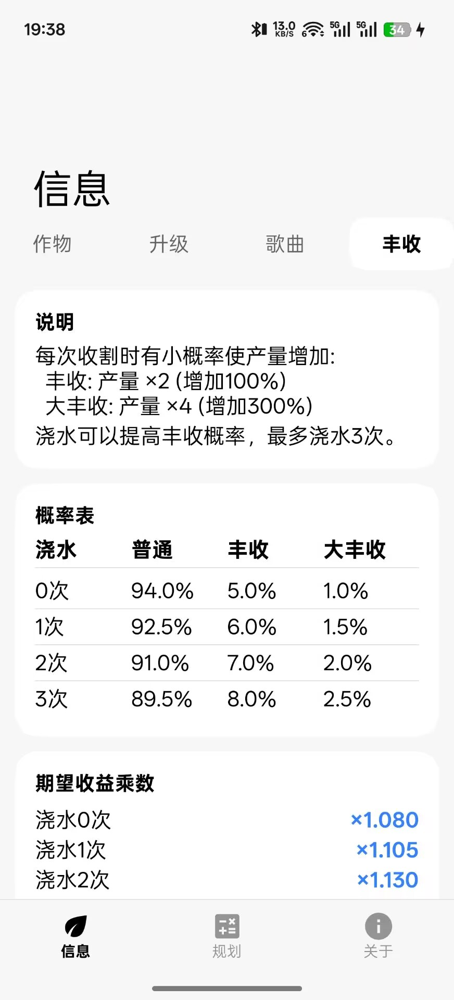
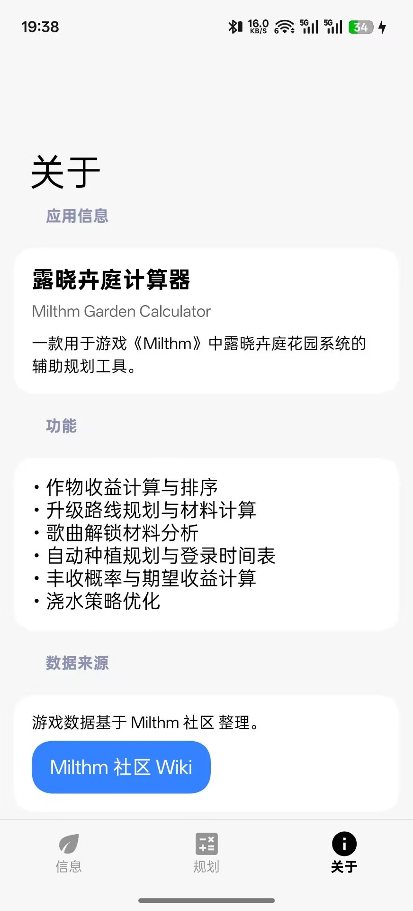

<!-- markdownlint-disable MD033 MD041 -->
<p align="center">
  
</p>

<div align="center">

# Milthm Garden Calc

<!-- prettier-ignore-start -->
<!-- markdownlint-disable-next-line MD036 -->
_✨ 音游 Milthm 花园系统辅助规划工具 ✨_
<!-- prettier-ignore-end -->

</div>

<p align="center">
  
  
  
</p>

## 简介

Milthm Garden Calc 是一款专为音游 [Milthm](https://store.steampowered.com/app/2351260/Milthm/) 设计的花园系统辅助规划工具。帮助玩家合理安排种植计划，高效获取材料以解锁歌曲和提升等级。

## 功能

- **种植规划器** — 根据登录时间和花盆数量，自动生成最优种植/收获计划
- **浇水模拟** — 模拟浇水冷却机制，计算最优浇水策略和期望产量
- **等级规划** — 计算从当前等级升级到目标等级所需的全部材料
- **歌曲解锁** — 计算解锁每首歌曲所需的材料清单
- **作物图鉴** — 查看所有作物的生长周期、产量、解锁条件
- **截图分享** — 一键生成规划方案图片，方便分享

## 截图





## 构建

```bash
./gradlew assemble
```

## 技术栈

- **语言**: Kotlin
- **UI**: Jetpack Compose + [Miuix](https://github.com/miuix-kotlin-multiplatform/miuix)
- **架构**: 单 Activity + Compose Navigation
- **最低版本**: Android 9 (API 28)
